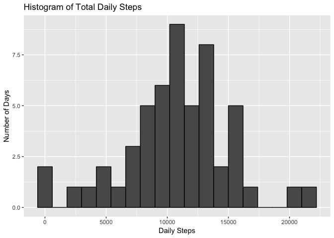
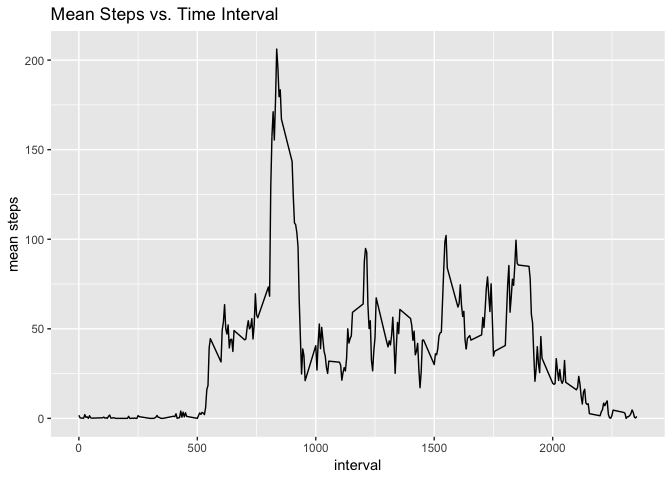

Loading and preprocessing the data
----------------------------------

    data <- read.csv("~/Downloads/activity.csv")

What is mean total number of steps per day?
-------------------------------------------

### 1. Calculate the total number of steps taken per day

    #aggregate the data set by summing steps in the same day
    data_day <- aggregate(data$steps, by=list(data$date), sum)
    #rename columns
    names(data_day)[1] = "date"
    names(data_day)[2] = "total_steps"
    #show head of the new dataset
    head(data_day)

    ##         date total_steps
    ## 1 2012-10-01          NA
    ## 2 2012-10-02         126
    ## 3 2012-10-03       11352
    ## 4 2012-10-04       12116
    ## 5 2012-10-05       13294
    ## 6 2012-10-06       15420

### 2. Make a histogram of the total number of steps taken each day

    #plot total daily steps
    library(ggplot2)
    ggplot(data_day, aes(x=total_steps)) + 
      geom_histogram(color = "black", binwidth = 1200) + 
      labs(title = "Histogram of Total Daily Steps", x = "Daily Steps", y = "Number of Days")

    ## Warning: Removed 8 rows containing non-finite values (stat_bin).

### 3. Calculate and report the mean and median of the total number of steps taken per day

    mean(data_day$total_steps, na.rm = TRUE)

    ## [1] 10766.19

    median(data_day$total_steps, na.rm = TRUE)

    ## [1] 10765

What is the average daily activity pattern?
-------------------------------------------

### 1. Make a time series plot of the 5-minute interval (x-axis) and the average number of steps taken, averaged across all days (y-axis)

    #subset of the data with NA removed
    data_clean <- data[!is.na(data$steps),]
    #aggregate the clean data set by taking the mean for each time interval
    data_clean_mean <- aggregate(data_clean$steps, by=list(data_clean$interval), mean)
    #rename columns of data_clean_mean
    names(data_clean_mean)[1] = "interval"
    names(data_clean_mean)[2] = "mean_steps"
    #time series plot
    ggplot(data_clean_mean, aes(x=interval, y=mean_steps))+
      geom_line(color="black")+
      labs(title="Mean Steps vs. Time Interval", x="interval", y="mean steps")

### 2. Which 5-minute interval, on average across all the days in the dataset, contains the maximum number of steps?

    max_mean <- data_clean_mean[which.max(data_clean_mean$mean_steps),]
    max_mean

    ##     interval mean_steps
    ## 104      835   206.1698
