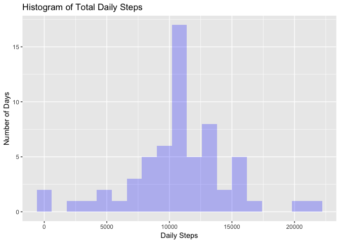
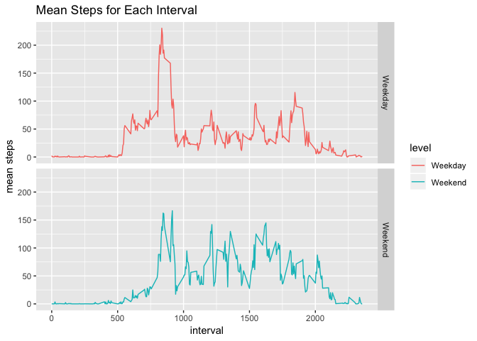

Loading and preprocessing the data
----------------------------------

    data <- read.csv("~/Downloads/activity.csv")

Imputing missing values
-----------------------

### 1. Calculate and report the total number of missing values in the dataset.

    missing <-sum(is.na(data$steps))
    missing

    ## [1] 2304

### 2. Devise a strategy for filling in all of the missing values in the dataset.

Strategy is using mean steps for a time interval across all days to
replace the missing steps for the same time interval at any day

### 3. Create a new dataset that is equal to the original dataset but with the missing data filled in.

    library(magrittr)
    library(dplyr)

    ## 
    ## Attaching package: 'dplyr'

    ## The following objects are masked from 'package:stats':
    ## 
    ##     filter, lag

    ## The following objects are masked from 'package:base':
    ## 
    ##     intersect, setdiff, setequal, union

    #new dataset is named data2
    data2 <- data
    #replace the missing value with the mean for the corresponding interval
    replace_with_mean <- function(x) replace(x, is.na(x), mean(x, na.rm = TRUE))
    data2 <- data2%>% group_by(interval) %>% mutate(steps=replace_with_mean(steps))
    #check no missing value
    sum(is.na(data2$steps))

    ## [1] 0

### 4a. Make a histogram of the total number of steps taken each day and Calculate and report the mean and median total number of steps taken per day.

    library(ggplot2)
    #aggregate the new data set by summing steps in the same day
    data2_day <- aggregate(data2$steps, by=list(data2$date), sum)
    #rename columns
    names(data2_day)[1] = "date"
    names(data2_day)[2] = "total_steps"
    #show head of the new dataset
    head(data2_day)

    ##         date total_steps
    ## 1 2012-10-01    10766.19
    ## 2 2012-10-02      126.00
    ## 3 2012-10-03    11352.00
    ## 4 2012-10-04    12116.00
    ## 5 2012-10-05    13294.00
    ## 6 2012-10-06    15420.00

    #plot total daily steps for new data
    ggplot(data2_day, aes(x=total_steps)) + 
      geom_histogram(fill = rgb(0,0,1,1/4), binwidth = 1200) + 
      labs(title = "Histogram of Total Daily Steps", x = "Daily Steps", y = "Number of Days")

### 4b. Do these values differ from the estimates from the first part of the assignment?

    #aggregate the data set by summing steps in the same day
    data_day <- aggregate(data$steps, by=list(data$date), sum)
    #rename columns
    names(data_day)[1] = "date"
    names(data_day)[2] = "total_steps"
    #show head of the new dataset
    head(data_day)

    ##         date total_steps
    ## 1 2012-10-01          NA
    ## 2 2012-10-02         126
    ## 3 2012-10-03       11352
    ## 4 2012-10-04       12116
    ## 5 2012-10-05       13294
    ## 6 2012-10-06       15420

    old_mean <- mean(data_day$total_steps, na.rm = TRUE)
    new_mean <- mean(data2_day$total_steps)
    old_mean

    ## [1] 10766.19

    new_mean

    ## [1] 10766.19

    new_mean - old_mean

    ## [1] 0

No Change in the mean.

    old_median <- median(data_day$total_steps, na.rm = TRUE)
    new_median <- median(data2_day$total_steps)
    old_median

    ## [1] 10765

    new_median

    ## [1] 10766.19

    new_median - old_median

    ## [1] 1.188679

Median increases by 1.19.

### 4c. What is the impact of imputing missing data on the estimates of the total daily number of steps?

Move the estimates towards the mean. Counts for mean steps increase.

Are there differences in activity patterns between weekdays and weekends?
-------------------------------------------------------------------------

### 1. Create a new factor variable in the dataset with two levels – “weekday” and “weekend” indicating whether a given date is a weekday or weekend day.

    #convert to Data format
    data2$weekday <- weekdays(as.Date(data2$date))
    #add level factor "Weekend, Weekday"
    data2$level <- ifelse(data2$weekday=="Saturday" | data2$weekday=="Sunday", "Weekend", "Weekday" )

### 2. Make a panel plot containing a time series plot of the 5-minute interval (x-axis) and the average number of steps taken, averaged across all weekday days or weekend days (y-axis).

    #aggregate data2 by level and by interval
    data2_mean <- aggregate(data2$steps, by=list(data2$level, data2$interval), mean)
    #rename the columns
    names(data2_mean)[1]="level"
    names(data2_mean)[2]="interval"
    names(data2_mean)[3]="mean_steps"
    #plot
    ggplot(data2_mean, aes(x = interval, y=mean_steps, color=level)) +
      geom_line() +
      facet_grid(level ~ .) +
      labs(title = "Mean Steps for Each Interval", x = "interval", y = "mean steps")

